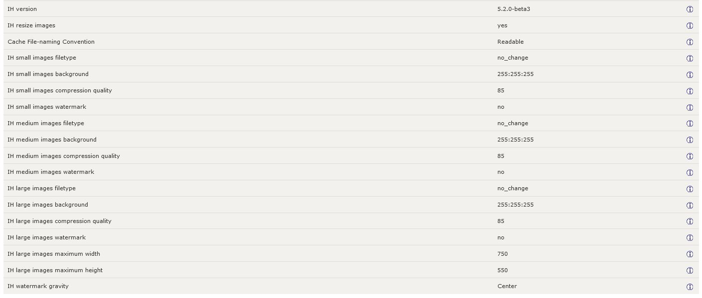

[Back](configuration.md "Return to the Configuration page")
# Configuration->Images
Image Handler5 works out of the box. There's no need to configure anything if you are ok with the presets, but if you want to change the way IH deals with your images navigate to your Zen Cart admin's **Configuration->Images** (after installation!).

If you are using _Fual Slimbox_ or _ColorBox for Zen Cart_ with IH5, be sure to read this section.

IH5 creates images (based on your image settings) in the `bmz_cache` directory. It does not replace or modify the original images.  You can use the IH5 admin-level image manager without using any of the storefront image-related features.

The IH installation adds settings to your admin's ***Configuration->Images*** page, as shown below.

You can tweak everything to your liking. The parameters are self explanatory and feature additional descriptions when you select them. These parameters enable you to tweak settings for:

- cache-file naming method
- preferred filetypes
- compression quality
- background color
- watermarking
- zooming (fancy hover effect)
- gravity for watermarking

The parameters to configure image dimensions have been enhanced to not only accept numerical values, but to accept parameters with an appended `!` which results in a force-canvas-size mode. Images are re-sized to fit and placed centered inside the fixed canvas instead of resizing the image to just one of the dimensions if it doesn't feature the same aspect ratio as the settings. 

That sounds too complicated? Trust me, it isn't. Just see for yourself: Configure a nice colored background and test both values with and without the appended `!`. Read more about it in this document's [Image Dimensions](c_dimensions.md) section.
