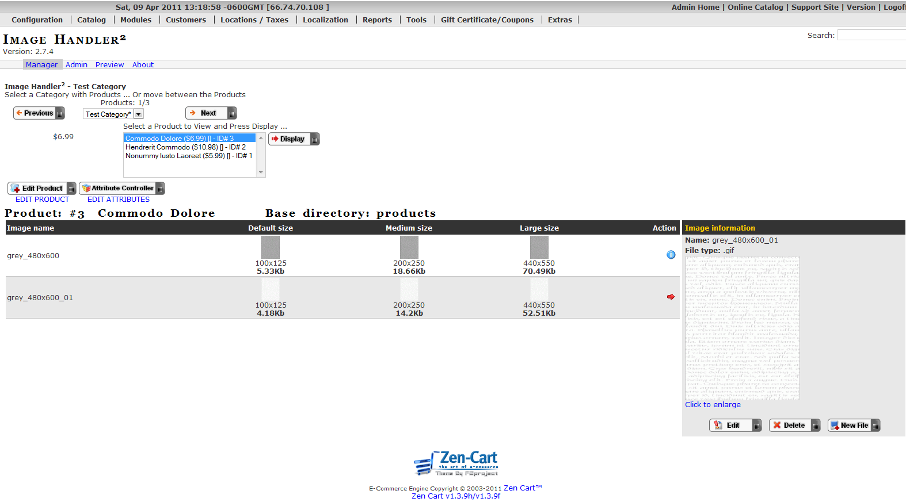

[Back](readme.md "Return to the main page")
# Using the Admin "Image Handler" Tool

There are two ways to access the Zen Cart admin's **Image Handler5** tool:
- **Catalog->Categories/Products**.  When you browse your categories and products, you can click on the small IH icon () to access the **Image Handler5** manager page _for a specific product_.

- **Tools->Image Handler5**. When you access the **Image Handler5** manager page you can use its interface to browse categories and products or to add, change, or delete images from your products.

The IH5 interface is designed to be highly intuitive and easy to use. Referencing the image above, you can see that all the action takes place on the "Manager" tab of the interface. For example:

-     You can browse through your product categories using the "Previous" and "Next" buttons
-     You can select a specific product category using the product category dropdown list and allowing the page to refresh & display all the products in that category
-     You can select a specific product to view, add, or edit (change or delete) its image(s) by selecting the category, then highlighting the product that appears in the list, and clicking the "Display" button.
-     You can even jump to the "Edit Products" or "Product Attribute" pages by clicking either of those buttons.

## Adding Images

It's all very straightforward. But let's talk about where some folks get stuck: adding primary and additional product images. Let's begin by walking through the process of adding an image to a product. The important thing to understand is that the process is the same whether you're adding your first image or your tenth to a given product

1.     Select the product you want to add an image to and click the "New File" button to the right of the product information
1.     Select the image directory from the dropdown list where you want the image to be stored on your server
1.     Click on the Default image file's "browse" button to navigate to the image you want to upload. It is best to upload the largest version of your image because this is the file that Image Handler5 will use to create small, medium, and large versions of that image.
1.     Click "Save". Notice that after clicking "Save", the page refreshes and you can now see your image(s) and all the sizes your image(s) will display as throughout various areas of your store.

### Important Notes:

-     You do not need to add an image to the "Medium" or "Large" fields **unless** you want your medium and large product images to be **different** images than that of your small product images.
-     IH5 will take care of creating small, medium, and large versions of the large image you uploaded, using the image size settings you have [configured](configuration.md).
-     Attempting to add an image in the "Medium" or "Large" fields without **first** populating that "Default" field will result in an error. You **must** always upload an image to the "Default" field whether it is your first product image or your hundredth.
-     The "Medium" and "Large" fields are not the appropriate place to add your additional product images. Remember that the process for adding primary and additional images is the same. The "Default" field must be used
-     "Default" does not refer to "Primary Image". "Default" only refers to the image file you upload that IH5 will use to make small medium and large versions of your image(s).
-     If all this talk about "primary images", "additional images", "large, medium, and small images", etc. has your head spinning, refer to the [Troubleshooting](troubleshooting.md) section of this readme and look at the "Prepare Your Site For Growth" section to gain a deeper understanding.

## Changing an Image

Next, let's walk through the process of changing a product's primary or additional image.

1.     Select the product whose image you'd like to change.
1.     Click the Action/info icon to the right of the image you want to change (whether it is the primary image or an additional image)
1.     Click the "Edit" button
1.     Click the Default image file's "browse" button to navigate to the image you want to upload, remembering that it is best to upload the largest version of your image because this is the file that Image Handler5 will use to create small, medium, and large versions of that image.
1.     Click the "Save" button

## Other Features

Finally, let's talk about those buttons and fields we skipped over, what they do, and how to use them.

1.     The Action/info icon allows you to access the "edit" and "delete" buttons. We've already discussed the "edit" button and the "delete" button should be self explanatory.
1.     The optional "Image base name" (which only appears when adding a new primary image file) allows you to name your image something other than its filename. Leaving it blank results in your image file being uploaded with it's current filename.
1.     The optional "Image Suffix" (which only appears when adding a new additional image file) allows you to add your preferred suffix to your additional images (in order to link your primary and additional images together for a given product). Or if you prefer, leave it blank and let Image Handler5 create a suffix for you.
1.     As previously discussed, the "Medium" and "Large" image fields that you see when you add or edit an image are to be used if you want your medium and large product images to be different images than that of your small product images.

## An Example

Let's do a quick example. You have this nice product, took a shot with your brand new digital camera and removed the background with your favorite image manipulation program (I suggest gimp). You save this file as Portable Network Graphic (png) to keep the alpha channel &mdash; the transparent areas where you want to look through to your website. Let's say the image is 600 pixels wide and has a height of 800 pixels (600x800). You specified 100x80 for your small images and 150x120 for your medium sized images.

Since the product listing view you use has different background colors for odd and even rows, you want to keep the transparency at least for small images. You choose `.png` or `.gif` for the small image filetype and `transparent` for the small image background.

Now you think of your medium and large sized images. You don't want them to be in the `.gif` format because it doesn't compress that well and you want to have more than 256 colors in your high resolution images. Further you don't care about transparency because you have just one background color in your product info page or the pop-up image window, so you can go with `.jpg`. That's what you specify for the medium and large image filetype. Let's assume you have a white background in both the product info page and the pop-up image window so you type `255:255:255` into the fields for medium- and large-image background.