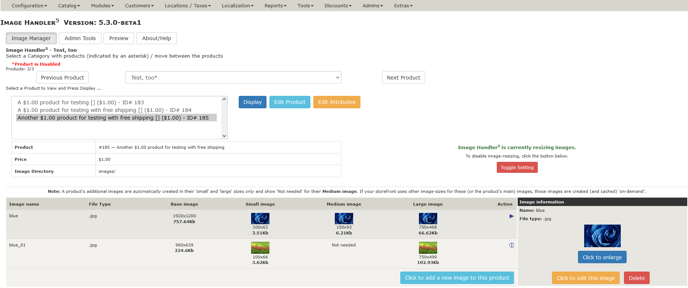
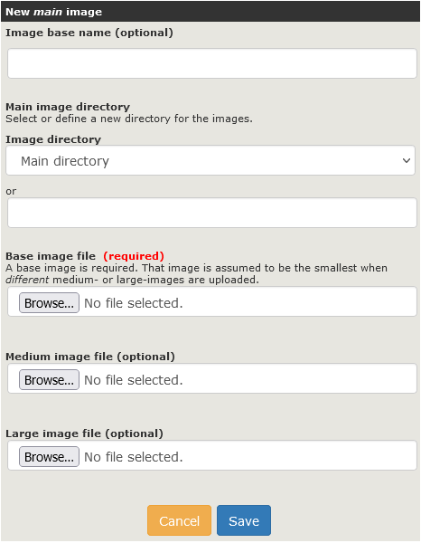
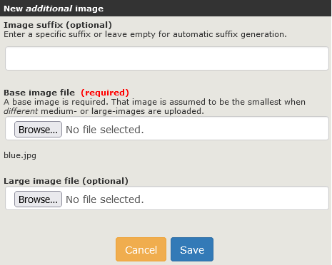
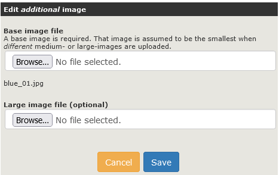

[Back](../README.md "Return to the main page")
# Using the Admin "Image Handler" Tool

1. [Accessing Image Handler](#accessing-image-handler)
2. [Managing Images](#managing-images)
   - [Overview](#overview)
   - [Adding Images](#adding-images)
   - [Changing an Image](#editing-an-image)
   - [Deleting an Image](#deleting-an-image)

## Accessing Image Handler

There are two ways to access the Zen Cart admin's **Image Handler5** tool:

1. Click the **Tools->Image Handler5** link in your admin's navigation header.
2. From the **Catalog->Categories/Products** products' listing.  When you browse your categories and products, you can click on the small IH icon () to access the **Image Handler5** manager page, initially, _for a specific product_.

- **Tools->Image Handler5**. When you access the **Image Handler5** manager page you can use its interface to browse categories and products or to add, change, or delete images from your products.

## Overview

The IH5 interface is designed to be highly intuitive and easy to use. Referencing the image below, you can see that all the action takes place on the _Image Manager_ tab of its interface. You can:

- Browse through your product categories using the `Previous` and `Next` buttons
- Select a specific product-category using the drop-down list; after the page refreshes, all products in that category are displayed.
- Select a specific product whose images are to be managed, by selecting the product from the product drop-down and clicking the `Display` button.
- Jump to edit that product or its attributes by clicking the `edit product` or `Attribute Controller` button, respectively.

The initial display for the selected-product depends on whether or not that product has a _base_ image defined: 

## Adding Images

It's all very straightforward. But let's talk about where some folks get stuck: adding _base_ and _additional_ product images. Let's begin by walking through the process of adding an image to a product. The important thing to understand is that the process slightly different when adding a new _main_ image to the product vs. adding additional images to that product.

### Important Notes:

- IH5 allows the upload of image files with file-extensions of `.jpg, .jpeg, .png or .gif`; all other file-extensions are disallowed.
	- The file-extension of any `additional` images uploaded for a product **must be the same** as the product's `main` image.
- You do not need to add an image to the "Medium" or "Large" fields **unless** you want your medium and/or large product images to be **different** images than that of your small product images.
- IH5 will take care of creating small, medium, and large versions of any base image you uploaded, using the image size settings you have [configured](configuration.md).
- Attempting to add a "Medium" or "Large" image without an accompanying "Base" image will result in an error. You **must** always upload a "Base" image for each main and additional product image uploaded.
- "Base" does not refer to a "Primary Image". "Base" only refers to the image file you upload that IH5 will use to make small medium and large versions of your image(s).
- If all this talk about "primary images", "additional images", "large, medium, and small images", etc. has your head spinning, refer to the [Troubleshooting](troubleshooting.md) section of this readme and look at the "Prepare Your Site For Growth" section to gain a deeper understanding.

### Adding a Main Image

When you add a new _main_ image to a product, the following fields are available:

**Image base name**.  Identify the base filename for the image.  If the image is to be named `my_image.png`, you'll enter _my_image_ in this field.  This "base" filename will be used for all additional product images, too.

If you don't enter a value in this field, the product's base/main image name will be defined by the filename of the **Base image file** that you upload.

**Image directory**.  This field identifies the directory (or sub-directory) within your store's `/images` directory into which all images for this product will be uploaded.  You can either use the drop-down list to choose an existing sub-directory or the input-field to identify a new sub-directory to be created to hold this product's images.

**Base image file**.  Click the `Browse` button to select a file from your local system to be uploaded and used as the product's base/main image.  If you don't choose a separate Medium or Large image file, then IH5 will automatically create those image sizes using the file you upload here.

It's best to upload the largest version of your image, since this is the file that Image Handler5 will use to create small, medium, and large sizes for the product's display.

**Medium image file**. Click the `Browse` button to select a _different_ image to be displayed as the product's "Medium" image.  The image's extension must be the same as the selected **Base image file**.

**Large image file**. Click the `Browse` button to select a _different_ image to be displayed as the product's "Large" image.  The image's extension must be the same as the selected **Base image file**.

Once you've chosen those options, click the `save` button to upload the selected image(s) to your store's file-system or click the `cancel` button to return to the main IH display.

### Adding an Additional Image

When you add a new _additional_ image to a product, the following fields are available:

**Image suffix**.  Identify the suffix to apply to this _additional_ image.  IH5 appends this suffix (e.g. `_01`) to the main product image's _Base name_ to create a unique name for this additional image. 

If you don't enter a value in this field, IH5 will automatically create a unique suffix (in the range _01 to _99) for this image.

**Base image file**.  Click the `Browse` button to select a file from your local system to be uploaded and used as the product's base/main image.  If you don't choose a separate Medium or Large image file, then IH5 will automatically create those image sizes using the file you upload here.

It's best to upload the largest version of your image, since this is the file that Image Handler5 will use to create small, medium, and large sizes for the product's display.

**Large image file**. Click the `Browse` button to select a _different_ image to be displayed as the this additional image's "Large" version.  The image's extension must be the same as the selected **Base image file**.

Once you've chosen those options, click the `save` button to upload the selected image(s) to your store's file-system or click the `cancel` button to return to the main IH display.

## Editing an Image

Next, let's walk through the process of changing a product's main or additional images.  The options available are dependent on which type of image you are editing.

### Edit a Main Image

When you edit the _main_ image for a product, the following fields are available:

**Base image file**.  Click the `Browse` button to upload a new file to be used as the base, main image.  This choice works with the radio-buttons displayed below.

You can choose to either _keep_ the existing image name (as displayed) or to use the name of the uploaded, base image as the product's new base name.  If you choose to use a _new_ product-image name, all `additional` images associated with the product **will be deleted** from your server.

**Medium image file**.  Click the `Browse` button to upload a new file to be used as the base for the main product's medium image.

**Large image file**.  Click the `Browse` button to upload a new file to be used as the base for the main product's large image.

### Edit an Additional Image

When you edit an _additional_ image for a product, the following fields are available:

**Base image file**.  Click the `Browse` button to upload a new file to be used as the base, additional image.  

**Large image file**.  Click the `Browse` button to upload a new file to be used as the base for the main product's large image.

## Deleting an Image

Just like the image add and edit operations, the options you have for the image's removal depend on whether you are deleting a product's _main_ image or one of its _additional_ images.

### Deleting a Main Image

When you choose to delete a _main_ product image, you can choose to remove _only_ the database reference to the image-file.  Otherwise, the _main_ product image's base, medium and large images are deleted from your server in addition to updating the database to indicate that the product no longer has a defined image.

**Note**: If the product has _additional_ images defined, you must delete those images separately.  The deletion of the product's main image **does not** result in the deletion of any product additional images!

### Deleting an Additional Image

When you choose to delete an additional image, that image's base and large images are both deleted from the server.

## An Example

Let's do a quick example. You have this nice product, took a shot with your brand new digital camera and removed the background with your favorite image manipulation program (I suggest gimp). You save this file as Portable Network Graphic (png) to keep the alpha channel &mdash; the transparent areas where you want to look through to your website. Let's say the image is 600 pixels wide and has a height of 800 pixels (600x800). You specified 100x80 for your small images and 150x120 for your medium sized images.

Since the product listing view you use has different background colors for odd and even rows, you want to keep the transparency at least for small images. You choose `.png` or `.gif` for the small image filetype and `transparent` for the small image background.

Now you think of your medium and large sized images. You don't want them to be in the `.gif` format because it doesn't compress that well and you want to have more than 256 colors in your high resolution images. Further you don't care about transparency because you have just one background color in your product info page or the pop-up image window, so you can go with `.jpg`. That's what you specify for the medium and large image filetype. Let's assume you have a white background in both the product info page and the pop-up image window so you type `255:255:255` into the fields for medium- and large-image background.
